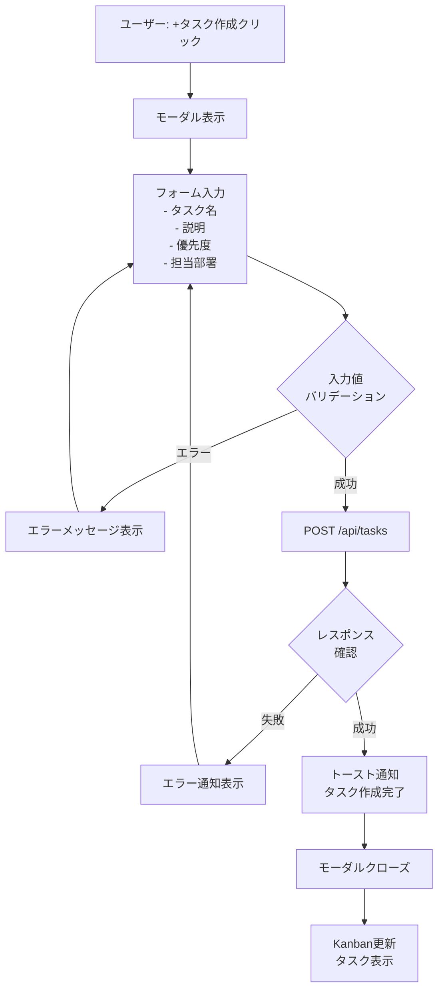
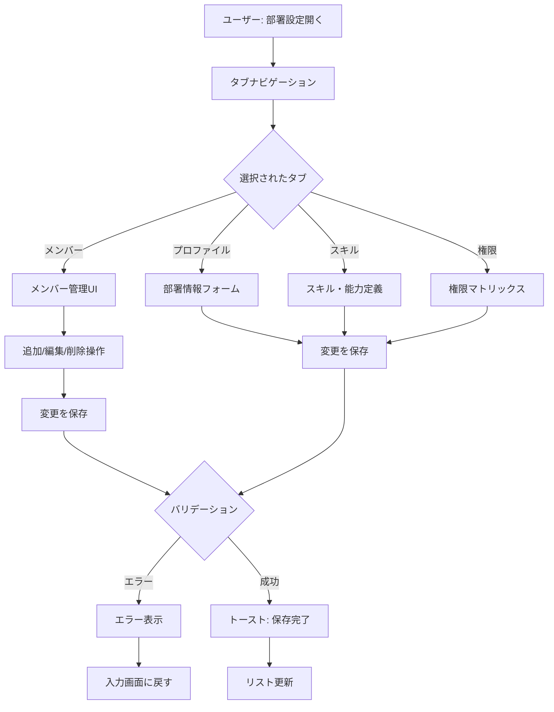

# THEBRANCH プラットフォーム ワイヤーフレーム設計

**タスク**: #2334  
**作成日**: 2026-04-20  
**フェーズ**: 第2フェーズ（ワイヤーフレーム・プロトタイプ設計）  
**フォーマット**: Markdown + ASCII Art + Mermaid

---

## 1. 主要ページワイヤーフレーム

### 1.1 ランディングページ (/)

```
┌────────────────────────────────────────────────────────────┐
│ THEBRANCH        [ログイン] [サインアップ]                   │
└────────────────────────────────────────────────────────────┘
│                                                              │
│  ┌──────────────────────────────────────────────────────┐  │
│  │                                                      │  │
│  │          🎯 ヒーロー画像 / 動画                      │  │
│  │    「翌朝から組織を持てる」                          │  │
│  │    採用でも外注でもなく、部署ごとAIで動かす。        │  │
│  │    ひとりがユニコーンになれる時代へ。              │  │
│  │                                                      │  │
│  │     [今すぐ始める] [デモを見る]                      │  │
│  │                                                      │  │
│  └──────────────────────────────────────────────────────┘  │
│                                                              │
│  ┌──────────────────────────────────────────────────────┐  │
│  │ 💡 メリット                                           │  │
│  ├──────────────────────────────────────────────────────┤  │
│  │ ⚡ 数分で AI チーム編成完了                          │  │
│  │ 🎯 カスタマイズ可能な部署構成                        │  │
│  │ 📊 リアルタイムタスク管理                            │  │
│  │ 🔄 外部サービス連携                                  │  │
│  └──────────────────────────────────────────────────────┘  │
│                                                              │
│  ┌──────────────────────────────────────────────────────┐  │
│  │ 📸 スクリーンショット (3列)                          │  │
│  │ ┌──────┐ ┌──────┐ ┌──────┐                         │  │
│  │ │ダッシュ│ │部署設定│ │タスク│                      │  │
│  │ │ボード  │ │       │ │管理  │                      │  │
│  │ └──────┘ └──────┘ └──────┘                         │  │
│  └──────────────────────────────────────────────────────┘  │
│                                                              │
│  Footer: 会社情報 / プライバシー / 利用規約 / サポート         │
│                                                              │
└────────────────────────────────────────────────────────────┘
```

**グリッド構成**: 12 columns  
**パディング**: 32px (desktop), 16px (mobile)  
**主要要素サイズ**:
- ヒーロー画像: 100% width, auto height (16:9 aspect)
- CTA ボタン: 160px × 48px
- メリットカード: 1/3 width (desktop), 100% (mobile)

---

### 1.2 サインアップページ (/signup)

```
┌────────────────────────────────────────────────────────────┐
│ THEBRANCH                          [ログイン]               │
├────────────────────────────────────────────────────────────┤
│                                                              │
│  ┌──────────────────────────────────────────────────┐      │
│  │ ✉️ アカウント作成                                 │      │
│  ├──────────────────────────────────────────────────┤      │
│  │                                                  │      │
│  │ Step 1/3: メールアドレスを入力                   │      │
│  │                                                  │      │
│  │ メールアドレス *                                 │      │
│  │ [━━━━━━━━━━━━━━━━━━━━━━━]                      │      │
│  │                                                  │      │
│  │ ━━ OR ━━                                        │      │
│  │                                                  │      │
│  │ [Google でサインアップ]                          │      │
│  │ [GitHub でサインアップ]                          │      │
│  │                                                  │      │
│  │                   [キャンセル] [次へ]            │      │
│  │                                                  │      │
│  └──────────────────────────────────────────────────┘      │
│                                                              │
│  ━━━━━━━━━━━━━━━━━━━━━━━━━━━━━━━━━━━━━━━━━━━━━━━        │
│  既にアカウントをお持ちですか？ [ログイン]                  │
│                                                              │
└────────────────────────────────────────────────────────────┘
```

**レイアウト**:
- 中央集約型カード (max-width: 400px)
- ステップ表示: プログレスバー (top)
- エラーメッセージ: インライン (赤)
- ボタンサイズ: full width

**ステップ 2** (パスワード設定):
```
│ Step 2/3: パスワードを設定                          │
│                                                  │
│ パスワード *                                     │
│ [━━━━━━━━━━━━━━━━━━━━━━━━] 👁️                   │
│                                                  │
│ パスワード確認 *                                 │
│ [━━━━━━━━━━━━━━━━━━━━━━━━] 👁️                   │
│                                                  │
│ 強度: 🟡 良好                                     │
│ ✓ 8文字以上                                      │
│ ✓ 大文字・小文字を含む                            │
│ ✓ 数字を含む                                     │
│ ✓ 記号を含む                                     │
```

**ステップ 3** (プロフィール入力):
```
│ Step 3/3: プロフィール情報                        │
│                                                  │
│ フルネーム *                                     │
│ [入力フィールド]                                  │
│                                                  │
│ 組織名 *                                         │
│ [入力フィールド]                                  │
│                                                  │
│ 業種                                            │
│ [ドロップダウン▼]                                 │
│                                                  │
│ □ 利用規約に同意します *                          │
│                                                  │
│                   [キャンセル] [作成]              │
```

---

### 1.3 メイン ダッシュボード (/dashboard)

```
┌────────────────────────────────────────────────────────────┐
│ 🏢 THEBRANCH  [🔍 検索]  🔔  🔧  👤                      │
├─────────────────────────────────────────────────────────┬──┤
│ 📊 ダッシュボード                                      │ │
│ 🎯 タスク                                             │ │
│ 📂 部署                                              │ │
│ 🤖 エージェント                                        │ │
│ 🔗 統合                                              ││
│ ⚙️ 設定                                              ││
│ ❓ ヘルプ                                             │ │
└─────────────────────────────────────────────────────┬──┤
│                                                        │  │
│ [📊 Overview | 📈 Kanban | 📉 Analytics | 🚨 Risks]   │  │
│                                                        │  │
│ ┌─────────────────────────────────────────────┐       │  │
│ │ 🎉 Welcome! あなたの AI 部署が稼働開始       │       │  │
│ └─────────────────────────────────────────────┘       │  │
│                                                        │  │
│ ┌────────────┬────────────┬────────────┬────────────┐ │  │
│ │ 📌 進行中  │ ✅ 完了    │ ⏸️ 保留   │ ❌ 失敗    │ │  │
│ │ 12 タスク  │ 45 タスク  │ 3 タスク  │ 1 タスク   │ │  │
│ └────────────┴────────────┴────────────┴────────────┘ │  │
│                                                        │  │
│ 本週の進度: 15/20 タスク (75%) ████████░░             │  │
│ 最終更新: 2分前                                       │  │
│                                                        │  │
│ ┌──────────────────────────────────────────────┐     │  │
│ │ 🚨 リソース利用状況                            │     │  │
│ ├──────────────────────────────────────────────┤     │  │
│ │ アクティブエージェント: 8/20 ████████░░░░░░░  │     │  │
│ │ 同時処理数: 28/30      ███████████░░ 93%⚠️    │     │  │
│ │ CPU: 62%              ██████░░░░░░░░         │     │  │
│ └──────────────────────────────────────────────┘     │  │
│                                                        │  │
│ ┌──────────────────────────────────────────────┐     │  │
│ │ Kanban ボード                                  │     │  │
│ │ Pending(5) In Progress(12) Blocked(2) Done(45)│     │  │
│ │ ┌────────┐ ┌────────────┐ ┌────────┐ ┌──────┐│     │  │
│ │ │Task #1 │ │Task #8     │ │Task #2 │ │Task #1││     │  │
│ │ │Eng Task│ │Design Rev  │ │Waiting │ │Complt││     │  │
│ │ │ [P1]   │ │ [P2]       │ │[P1]⚠️ │ │ [✓] ││     │  │
│ │ │Eng #1  │ │Design #2   │ │Eng #1  │ │Des#1 ││     │  │
│ │ │══════  │ │═════════   │ │════    │ │═════ ││     │  │
│ │ │ 60%    │ │ 40%        │ │ 0%     │ │100%  ││     │  │
│ │ │🕐 12m  │ │ 🕐 25m     │ │ 🕐 1h2m│       ││     │  │
│ │ └────────┘ └────────────┘ └────────┘ └──────┘│     │  │
│ │ [+ タスク作成]                                 │     │  │
│ └──────────────────────────────────────────────┘     │  │
│                                                        │  │
│ ┌──────────────────────────────────────────────┐     │  │
│ │ 🚨 リスク・ボトルネック                         │     │  │
│ ├──────────────────────────────────────────────┤     │  │
│ │ ⚠️ 滞留タスク:                                 │     │  │
│ │   • Task #15 (95分, Pending)                  │     │  │
│ │   • Task #12 (42分, In Progress)              │     │  │
│ │                                              │     │  │
│ │ 🔴 ブロッカー:                                 │     │  │
│ │   • Task #2 (Task #8 待ち)                    │     │  │
│ └──────────────────────────────────────────────┘     │  │
│                                                        │  │
└────────────────────────────────────────────────────────┘  │
```

**レイアウト**:
- 左サイドバー: 160px (sticky)
- メインコンテンツ: 残り幅
- グリッド: 12 columns
- ガター: 20px

---

### 1.4 部署設定ページ (/departments/:id/settings)

```
┌────────────────────────────────────────────────────────────┐
│ THEBRANCH  [🔍]  🔔  🔧  👤                               │
├─────────────────────────────────────────────────────────┬──┤
│ 📂 部署                                                  │ │
│ (その他メニュー)                                         │ │
├─────────────────────────────────────────────────────────┼──┤
│                                                        │  │
│ ◀ 戻る    🏢 Engineering 設定                        │  │
│                                                        │  │
│ [📋 メンバー | 👤 プロファイル | 💡 スキル | 🔐 権限]    │  │
│                                                        │  │
│ ┌────────────────────────────────────────────────────┐│  │
│ │ 📋 メンバー管理 (Active タブ)                       ││  │
│ ├────────────────────────────────────────────────────┤│  │
│ │                                                    ││  │
│ │ [+ メンバーを追加]                                 ││  │
│ │                                                    ││  │
│ │ ┌──────────┬────────┬──────────┬──────────────┐  ││  │
│ │ │名前      │役職    │ステータス│アクション    │  ││  │
│ │ ├──────────┼────────┼──────────┼──────────────┤  ││  │
│ │ │Eng #1   │Engineer│🟢 Active │編集  削除    │  ││  │
│ │ │Eng #2   │Engineer│🟢 Active │編集  削除    │  ││  │
│ │ │QA #1    │QA     │🟡 Idle   │編集  削除    │  ││  │
│ │ │Design #1│Designer│🟢 Active │編集  削除    │  ││  │
│ │ └──────────┴────────┴──────────┴──────────────┘  ││  │
│ │                                                    ││  │
│ │ 最大メンバー数: 20 (現在: 4)                     ││  │
│ └────────────────────────────────────────────────────┘│  │
│                                                        │  │
│ [保存] [キャンセル]                                    │  │
│                                                        │  │
└────────────────────────────────────────────────────────┘  │
```

**プロファイルタブ**:
```
│ 👤 部署プロファイル                                     │
├───────────────────────────────────────────────────────┤
│                                                       │
│ 部署名 *                                             │
│ [━━━━━━━━━━━━━━ Engineering ━━━━━━━━━━━━━━━]         │
│                                                       │
│ 説明                                                │
│ [━━━━━━━━━━━━━━━━━━━━━━━━━━━━━━━━━━━━━━━━━] │
│  ソフトウェア開発チーム                                │
│ [━━━━━━━━━━━━━━━━━━━━━━━━━━━━━━━━━━━━━━━━━]         │
│                                                       │
│ アイコン                                             │
│ [📎 画像を選択] (JPG/PNG, 最大 2MB)                  │
│                                                       │
│ カラーテーマ                                         │
│ [🎨 ━━━━━━━━━] (現在: ブルー)                        │
│                                                       │
│ Slack 連携                                          │
│ [接続] or [接続済み] [解除]                           │
│                                                       │
│ Discord 連携                                        │
│ [接続] or [接続済み] [解除]                           │
│                                                       │
│ [保存] [キャンセル]                                   │
```

---

### 1.5 役割・能力定義ページ (/role-library)

```
┌────────────────────────────────────────────────────────────┐
│ THEBRANCH  [🔍]  🔔  🔧  👤                               │
├─────────────────────────────────────────────────────────┬──┤
│ (サイドバー)                                             │ │
├─────────────────────────────────────────────────────────┼──┤
│                                                        │  │
│ 🤖 役割ライブラリ・AI能力定義                            │  │
│                                                        │  │
│ [エンジニア] [デザイナー] [PM] [QA] [セールス]           │  │
│                                                        │  │
│ ┌────────────────────────────────────────────────────┐│  │
│ │ 🔧 Engineer (エンジニア)                           ││  │
│ ├────────────────────────────────────────────────────┤│  │
│ │                                                    ││  │
│ │ 役割説明:                                          ││  │
│ │ ソフトウェア開発・保守・最適化を担当                ││  │
│ │                                                    ││  │
│ │ デフォルト能力セット:                               ││  │
│ │ ☑ バックエンド開発 (Python, Node.js, Go)           ││  │
│ │ ☑ データベース設計 (SQL, NoSQL)                    ││  │
│ │ ☑ API設計・実装 (REST, GraphQL)                  ││  │
│ │ ☑ テスト・デバッグ                                ││  │
│ │ ☑ コードレビュー                                  ││  │
│ │ ☐ DevOps・インフラ (カスタマイズ可能)              ││  │
│ │                                                    ││  │
│ │ デフォルト権限:                                    ││  │
│ │ ✓ タスク閲覧 / 作成 / 編集                         ││  │
│ │ ✗ タスク削除                                      ││  │
│ │ ✗ 承認権限                                        ││  │
│ │                                                    ││  │
│ │ プロンプト例:                                       ││  │
│ │ [━━━━━━━━━━━━━━━━━━━━━━━━━━━━━━━━━]              ││  │
│ │  「あなたはシニアバックエンドエンジニア...」           ││  │
│ │ [━━━━━━━━━━━━━━━━━━━━━━━━━━━━━━━━━]              ││  │
│ │                                                    ││  │
│ │ [このテンプレートを使用] [カスタマイズ]             ││  │
│ └────────────────────────────────────────────────────┘│  │
│                                                        │  │
│ ┌────────────────────────────────────────────────────┐│  │
│ │ 🎨 Designer (デザイナー)                           ││  │
│ │ ...                                                ││  │
│ └────────────────────────────────────────────────────┘│  │
│                                                        │  │
│ ┌────────────────────────────────────────────────────┐│  │
│ │ 👨‍💼 Product Manager (PM)                           ││  │
│ │ ...                                                ││  │
│ └────────────────────────────────────────────────────┘│  │
│                                                        │  │
└────────────────────────────────────────────────────────┘  │
```

---

### 1.6 タスク作成モーダル (/create-task または modal)

```
┌──────────────────────────────────────────────┐
│ ✎ 新しいタスクを作成                           │
├──────────────────────────────────────────────┤
│                                              │
│ タスク名 *                                   │
│ [━━━━━━━━━━━━━━━━━━━━━━━━━━━━━━━]           │
│                                              │
│ 説明                                         │
│ [━━━━━━━━━━━━━━━━━━━━━━━━━━━━━━━]           │
│ [━━━━━━━━━━━━━━━━━━━━━━━━━━━━━━━]           │
│ [━━━━━━━━━━━━━━━━━━━━━━━━━━━━━━━]           │
│                                              │
│ 優先度 *                                     │
│ [🔴 P1] [🟡 P2] [⚪ P3]  (P2 selected)      │
│                                              │
│ 担当部署 *                                   │
│ [Engineering ▼]                             │
│                                              │
│ 担当エージェント (オプション)                  │
│ [Eng #1 ▼]                                  │
│                                              │
│ 期限                                         │
│ [━━━━━━━━━━] (YYYY-MM-DD)                   │
│                                              │
│ タグ                                         │
│ [+ タグ追加] [backend] [urgent]             │
│                                              │
│                                              │
│       [キャンセル] [作成]                     │
│                                              │
└──────────────────────────────────────────────┘
```

---

## 2. レスポンシブ設計

### 2.1 モバイル (< 640px)

```
┌────────────────────┐
│ ☰ THEBRANCH 🔔 👤 │
├────────────────────┤
│                    │
│ [📊 Kanban]        │
│                    │
│ ┌────────────────┐ │
│ │Task #1         │ │
│ │Eng. Task       │ │
│ │[P1]            │ │
│ │Eng #1          │ │
│ │████░░░ 60%     │ │
│ └────────────────┘ │
│ ┌────────────────┐ │
│ │Task #2         │ │
│ │...             │ │
│ └────────────────┘ │
│                    │
│ [+ タスク作成]      │
│                    │
└────────────────────┘

[ハンバーガーメニュー展開時]
┌────────────────────┐
│ ダッシュボード      │
│ タスク             │
│ 部署               │
│ エージェント       │
│ 統合               │
│ 設定               │
│ ログアウト         │
└────────────────────┘
```

### 2.2 タブレット (640px - 1024px)

左サイドバー (120px) + メインコンテンツ  
メニュー: テキスト + アイコン (簡潔表示)

### 2.3 デスクトップ (> 1024px)

左サイドバー (160px) + メインコンテンツ  
メニュー: テキスト + アイコン (詳細表示)

---

## 3. インタラクション設計

### 3.1 ボタンの状態

```
通常:     [作成]     (背景: primary, テキスト: white)
ホバー:   [作成]     (背景: primary-dark, shadow)
アクティブ: [作成]   (背景: primary-dark, border: 2px)
無効:     [作成]     (背景: gray-200, テキスト: gray-400, cursor: disabled)
ローディング: [作成] (spinner 表示, disabled)
```

### 3.2 フォーム入力の状態

```
デフォルト:
[━━━━━━━━━━━━━━━━━━━]

フォーカス時:
[━━━━━━━━━━━━━━━━━━━]  (border: primary, shadow)

エラー時:
[━━━━━━━━━━━━━━━━━━━]  (border: red, icon: ❌)
❌ このメールアドレスは既に登録されています

成功時:
[━━━━━━━━━━━━━━━━━━━]  (border: green, icon: ✓)
```

### 3.3 ホバー・クリック効果

**カード** (タスク・部署):
- ホバー: shadow 追加, scale: 1.02
- クリック: opacity: 0.9 → 詳細ページ遷移

**ボタン**:
- ホバー: background-color 濃くなる
- クリック: active state 表示
- トランジション: 200ms ease-out

**テーブル行**:
- ホバー: background-color: gray-50
- クリック: 詳細ページ遷移

---

## 4. オーバーレイ・モーダル設計

### 4.1 モーダルの外観

```
背景: rgba(0, 0, 0, 0.5) (semi-transparent)
モーダル: 背景: white, border-radius: 8px, shadow: 0 10px 40px rgba(0,0,0,0.2)
最大幅: 480px (mobile: 90vw)
```

### 4.2 ダイアログの種類

**確認ダイアログ**:
```
┌──────────────────────────┐
│ ⚠️ 確認                   │
├──────────────────────────┤
│ 本当に削除しますか？       │
│ (復旧できません)           │
│                          │
│ [キャンセル] [削除]       │
└──────────────────────────┘
```

**アラートダイアログ**:
```
┌──────────────────────────┐
│ ❌ エラー                  │
├──────────────────────────┤
│ リソース制限に達しました    │
│                          │
│ [サポートに連絡] [閉じる]│
└──────────────────────────┘
```

---

## 5. トランジション・アニメーション

| 要素 | トランジション | 時間 |
|---|---|---|
| ボタン hover | background-color | 200ms |
| モーダル表示 | opacity + scale | 300ms |
| ページ遷移 | fade | 150ms |
| トースト通知 | slide-in + fade | 300ms |
| ローディング | spinner rotation | continuous |
| ツールチップ | fade + scale | 200ms |

---

## 6. 空状態（Empty State）設計

### 6.1 タスクなし

```
┌────────────────────────────────────┐
│                                    │
│          📭 タスクなし              │
│                                    │
│   「最初のタスクを作成しましょう」   │
│                                    │
│      [+ 今すぐ作成]               │
│                                    │
└────────────────────────────────────┘
```

### 6.2 検索結果なし

```
┌────────────────────────────────────┐
│         🔍 検索結果なし              │
│                                    │
│  「{query}」に該当するタスクはありません│
│                                    │
│  検索条件を変更してみてください。    │
│                                    │
└────────────────────────────────────┘
```

---

## 7. Mermaid フロー図：タスク作成フロー



---

## 8. Mermaid フロー図：部署設定フロー



---

## 9. コンポーネント一覧

### 基本要素

| コンポーネント | 用途 | 状態 |
|---|---|---|
| Button | CTA・操作 | default, hover, active, disabled, loading |
| Input | テキスト入力 | default, focus, error, success |
| Dropdown | 選択 | closed, open, disabled |
| Checkbox | 複数選択 | unchecked, checked, indeterminate |
| Radio | 単一選択 | unselected, selected |
| Modal | 詳細・フォーム | hidden, visible |
| Card | 情報表示 | default, hover, active |
| Badge | ラベル | info, success, warning, error |
| Toast | 通知 | success, error, info, warning |

### 複合コンポーネント

| コンポーネント | 構成 |
|---|---|
| TaskCard | 画像 + タイトル + メタ + 進捗バー |
| DepartmentCard | アイコン + 名前 + メンバー数 + アクション |
| Kanban | 列 + カード + ドラッグ&ドロップ |
| DataTable | ヘッダ + 行 + ページング |
| Tabs | タブナビ + コンテンツ |
| NavigationSidebar | メニュー + アイコン |

---

## 10. まとめ

本ワイヤーフレーム設計では、THEBRANCH プラットフォームの主要ページ・インタラクション・レスポンシブ対応を詳細に定義しました。

**次フェーズ**: デザインシステム基礎 → 高忠度プロトタイプ → 実装開始
